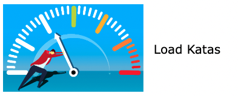

<p align="center">
    
</p>
<hr style="border:1px solid gray">

###Develop your skills in performance testing.

## General info
This project will help you practice load testing. It includes a LoadKatas app which is 
a custom-developed application that exposes an API which you can leverage when trying out different
load test scripts. 

In addition to the LoadKatas app, you can find here a set of katas - challenges that 
are tool agnostic and give you the context and the purpose for running different 
load testing scenarios. 

[Note: more katas will be published soon...]

## Prerequisties
1. Docker https://docs.docker.com/desktop/install/mac-install/
2. Node https://nodejs.org/en/download/

Additionally, you will need a load testing tool of your choice. This project provides solutions
for the katas in three specific tools: jmeter, k6 and locust. However, feel free to experiment
with any tool you want.

## Run LoadKatas app

Start in the root `/loadKatas`

```
npm install
npm run run-mongo
npm run app
```

The above will:
* install dependencies from package.json 
* run dockerized mongo database 
* run LoadKatas app

## Stop LoadKatas app
```
Ctrl+C 
npm run kill-mongo
```

Note: that the database does not persist data when you kill the docker container.

## Katas

### Prerequisites
You're going to need a load testing tool. Install it on your own.

* Jmeter: https://octoperf.com/blog/2017/10/26/how-to-install-jmeter-mac/
* K6: https://k6.io/docs/getting-started/installation/
* Locust: https://docs.locust.io/en/stable/installation.html

### Support
The project includes a support for jmeter, k6 and locust test runs. 
If you want to use it, run:
```
cp .env_example .env
```
`.env` file includes some variables that will help you keep the configuration in one place.
You can set there the place of your script and the test run config. 

Next, run one of the following commands:
```
npm run _jmeter
```
```
npm run _k6
```
```
npm run _locust
```
Each command will load env variables from `.env` file and will run the tool
using the configuration that you specified in the file.

### Challenges

Go to `/katas` directory to learn more about katas.

## LoadKatas App
LoadKatas app is a custom-developed application that exposes an API that can
be leveraged for load testing purposes. The goal of the project is to 
expose more than one API. 

The app should be run locally because:
* you don't have to deal with deployments
* you don't have to worry about clouds capacity limits
* you don't have to saturate your bandwidth

### Throttling & Latency
In order to simulate a behaviour of an application under load, the app was wrapped with
an artificial latency and throttling.

Latency - the greater the traffic, the greater the latency. There are tresholds that increase 
latency from certain points.

Throttling - the endpoints will handle load successfully only to some point, even if the latency is high. 
However, once this point is achieved, the endpoints will start returning errors.

### API Documentation
Run `npm run swagger-autogen`.

The command will run the app in the swagger mode. 
The documentation will be available under: http://localhost:3000/doc/#/

## Development

If you have ideas for the project and you want to contribute:

``npm run app-dev``

Note: The development mode runs nodemon which reloads the app everytime you save changes.
